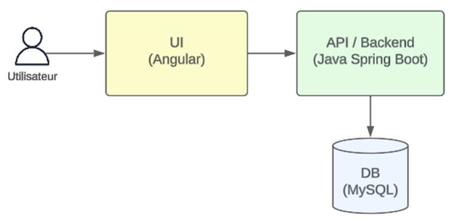
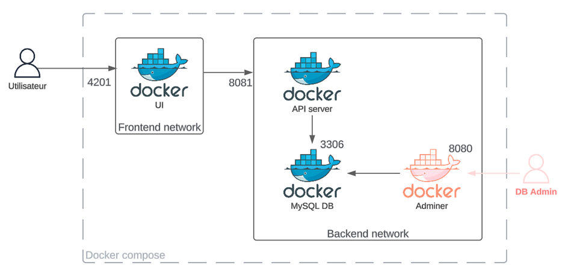
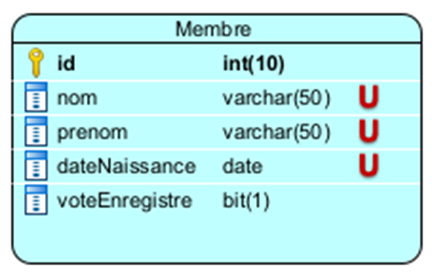
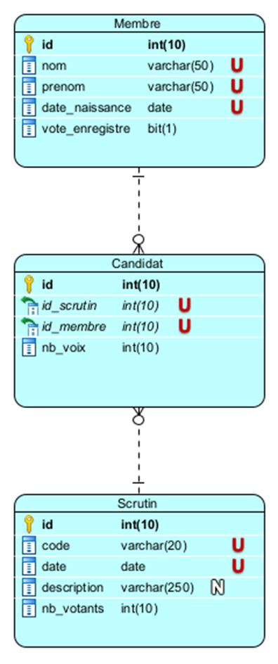

# Innotech Votes

[](https://github.com/aubertaa/innotech-votes/actions/workflows/ci.yml)

## Description

- Le scrutin ayant lieu dans quelques heures seulement, l’urgence première est de fiabiliser l’émargement des votants et de s’assurer par un outil adapté que chaque membre ne vote bien qu’une seule fois (des réclamations ont en effet été reçues à ce sujet lors de la précédente élection).
- L’interface doit être très simple d’utilisation pour permettre aux membres du bureau de vote de l’utiliser facilement et sans ambiguïté.
- Les membres de l’association étant connus, la liste sera insérée directement en base de données pour cette version.


## Architecture
L’architecture est la suivante. Cette architecture évolutive et les technologies choisies permettront de servir au mieux les fonctionnalités demandées, tout en assurant la présentation d’une interface moderne et intuitive :


Tous les composants de l'application sont conteneurisés à l'aide de Docker.



Cela permet de garantir que l'application fonctionne de la même manière sur tous les environnements.
Cela facilite également le déploiement et l'exécution de l'application.

### Frontend
Le frontend de l'application est développé en utilisant le framework Angular.

### Backend
Le backend de l'application est développé en utilisant le framework Spring Boot.

### Base de données
La base de données utilisée est MySQL. (une base in memory H2 est utilisé pour les tests et la phase de développement)

Le modèle de la base de données est le suivant :



## Fonctionnalités

### V1
Les fonctionnalités de la première version de l'application sont les suivantes :

- Affichage de la liste des membres de l'association
- Emargement (définitif) lors du vote

### V2
Les fonctionnalités prévues pour la version 2 sont les suivantes :

- Avant le scrutin
  - Ajout/suppression/modification de membres de l’association
  - Création d’un scrutin
  - Identification des candidats
- Pendant le scrutin
  - Formulaire de vote
  - Comptage des voix exprimées pour chaque candidat
  - Présentation du taux de participation
- Clôture du scrutin
  - Historisation du nombre de votants
  - Réinitialisation du statut ‘à voté’ de tous les membres de l’association
  - Production de graphiques de résultats

Le modèle de données devra alors évoluer vers ceci:



## Documentation

### Swagger UI

- Une documentation dynamique OpenAPI au format Swagger est disponible à l'adresse suivante, une fois l'application démarrée sur votre poste : `http://localhost:8081/swagger-ui.html`

## Procédure de build / validation

- Github Actions a été utilisé pour la CI/CD du projet.
- Les étapes de build et de validation sont disponibles dans le fichier `.github/workflows/ci.yml`, elles incluent:
  - compilation du code Java
  - exécution des tests unitaires
  - compilation du code Angular
  - exécution des tests unitaires Angular
  - création des images Docker via `docker-compose`
  - run des tests au niveau système :
    - réponse de l'api, de l'interface, de la base de données, de l'interface swagger
  - push des images Docker sur le Docker Hub (https://hub.docker.com/u/aubertaa)

- La CI est déclenchée automatiquement lors du push dans le dépôt Github.
- Pour déclencher un build en local, il suffit de lancer la commande suivante à la racine du projet:

```bash
docker-compose build
```

## Procédure de déploiement

- Le déploiement est automatisé grâce à l'usage de docker-compose. Il suffit de lancer la commande suivante pour démarrer l'application sur votre poste/un serveur de production:

```bash
docker-compose up --no-build
```

## Liens utiles

### Sources et livrables
- [Github repository](https://github.com/aubertaa/innotech-votes/)
- [Docker Hub](https://hub.docker.com/u/aubertaa) 
  - Innotech-votes-frontend
  - Innotech-votes-backend
- [Github Actions](https://github.com/aubertaa/innotech-votes/actions)
- [Artifacts de CI](https://github.com/aubertaa/innotech-votes/actions/workflows/ci.yml) (click on last run to see the artifacts)
  - Rapport de test backend (avec couverture)
  - Rapport de test frontend (avec couverture)
  - Binaire autonome de l'application backend

### Accès à l'application
- [Swagger UI](http://localhost:8081/swagger-ui.html)
- [Angular App](http://localhost:4201)
- [Spring Boot App](http://localhost:8081)


